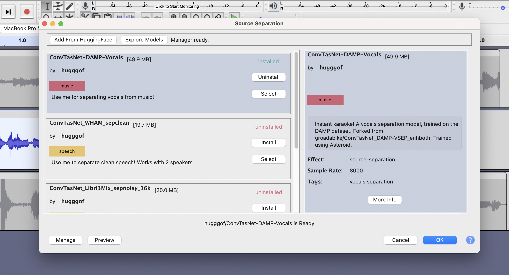

# audacitorch

This package contains utilities for prepping PyTorch audio models for use with the tensorjuce framework.

More specifically, it provides abstract classes for you to wrap your waveform-to-waveform.   

## Table of Contents
- [Downloading Audacity with Deep Learning](#download)
- [Installing](#pip)
- [Contributing Models to Audacity](#contrib)
- [Choosing an Effect Type ](#effect-types)
    - [Waveform to Waveform models](#wav2wav)
    - [Waveform to Labels models](#wav2labels)
- [Model Metadata](#metadata)
- [Making Your Model Built-In to Audacity](#builtin)
- [Debugging Your Model in Audacity](#debugging)
- [Example - Waveform-to-Waveform](#example-wav2wav)
    - [Making sure your model is compatible with `torchscript`](#compat)
- [Examples](#examples)

--- 



<a name="download"/>

## Download Audacity with Deep Learning

Our work has not yet been merged to the main build of Audacity, though it will be soon. You can keep track of its progress by viewing our [pull request](https://github.com/audacity/audacity/pull/1384). In the meantime, you can download an alpha version of [Audacity + Deep Learning here](https://interactiveaudiolab.github.io/project/audacity.html).

## Installing

<a name="pip"/>

You can install `audacitorch` using pip: 

```
pip install audacitorch
```

<a name="contrib"/>

## Contributing Models  


### Waveform to Waveform models

Waveform-to-waveform models receive a single multichannel audio track as input, and may write to a variable number of new audio tracks as output.

Example models for waveform-to-waveform effects include source separation, neural upsampling, guitar amplifier emulation, generative models, etc. Output tensors for waveform-to-waveform models must be multichannel waveform tensors with shape `(num_output_channels, num_samples)`. For every audio waveform in the output tensor, a new audio track is created in the Audacity project. 


<a name="metadata"/>

## Scripting a Model

Once you have chosen the appropriate class type for your model from the provided audacitorch Deep Learning Effect and the Deep Learning Analyzer classes, you will need to create a model file for use in Audacity. This model file allows a trained model to be executed in Audacity.

There are several methods available to create a file for an executable deep learning model. The purpose of serializing the model into a file is to enable our C++ code to execute your model. To serialize a model, our framework utilizes files generated from TorchScript. An important note is that TorchScript does not facilitate model training. When investigating TorchScript, you may also come across the term LibTorch, which is a PyTorch C++ API. LibTorch contains the core components of PyTorch, allowing TorchScript files to be executed in C++. However, you do not need to interact directly with LibTorch to serialize your model.

TorchScript enables the serialization of PyTorch code and is included with the PyTorch module - no additional modules are required. Currently, the deep learning tools for Audacity do not support models running on the GPU. [More information on TorchScript can be found in the PyTorch documentation](https://pytorch.org/docs/stable/jit.html).

TorchScript features a JIT module, where JIT stands for Just-In-Time Compiler. The TorchScript JIT analyzes PyTorch code and translates it into TorchScript. There are two methods for converting PyTorch code into TorchScript:

- Tracing: torch.jit.trace constructs the computational graph of your model by tracing the path of sample inputs through your model.

- Scripting: This method parses the PyTorch code to compile a graph for TorchScript. Scripting is a more robust method for generating a TorchScript version of your model, as tracing can overlook certain logic embedded in the Python code of your model.

These two approaches can be combined, with [more information available in the TorchScript documentation](https://pytorch.org/docs/stable/jit.html#mixing-tracing-and-scripting). We recommend using TorchScript scripting whenever possible for more robust model serialization.

Serializing a model can be a challenging task with many unique edge cases. To help you navigate this process, we have provided several [examples](#examples).

## Model Metadata

Certain details about the model, such as its sample rate, etc. must be provided by the model contributor. In order to help users choose the correct model for their required task, model contributors are asked to provide a short description of the model, among some other fields. 

#### Metadata Spec

required fields:

- `sample_rate` (`int`)
    - range `(0, 396000)`
    - Model sample rate. Input tracks will be resampled to this value. 
- `domains` (`List[str]`)
    - List of data domains for the model. The list should contain any of the following strings (any others will be ignored): `["music", "speech", "environmental", "other"]`
- `short_description`(`str`)
    -  max 60 chars
    -  short description of the model. should contain a brief message with the model's purpose, e.g. "Use me for separating vocals from the background!". 
-  `long_description` (`str`)
    -  max 280 chars
    -  long description of the model. Shown in the detailed view of the model UI.
-  `tags` (`List[str]`)
    -  list of tags (to be shown in the detailed view)
    -  each tag should be 15 characters max
    -  max 5 tags per model. 
-  `labels` (`List[str`)
    -  output labels for the model. Depending on the effect type, this field means different things
    -  **waveform-to-waveform**
        -  name of each output source (e.g. `drums`, `bass`, `vocal`). To create the track name for each output source, each one of the labels will be appended to the mixture track's name.
    -  **waveform-to-labels**:
        -  This should be classlist for model. The class indexes output by the model during a forward pass will be used to index into this classlist.  
-  `effect_type` (`str`)
    -  Target effect for this model. Must be one of `["waveform-to-waveform", "waveform-to-labels"]`. 
-  `multichannel` (`bool`)
    -  If `multichannel` is set to `true`, stereo tracks are passed to the model as multichannel audio tensors, with shape `(2, n)`. Note that this means that the input could either be a mono track with shape `(1, n)` or stereo track with shape `(2, n)`.
    -  If `multichannel` is set to `false`, stereo tracks are downmixed, meaning that the input audio tensor will always be shape `(1, n)`.

---

<a name="builtin"/>

## Making Your Model Built-In To Audacity

By default, users have to click on the `Add From HuggingFace` button on the Audacity Model Manager and enter the desired repo's ID to install a community contributed model. If you, instead, would like your community contributed model to show up in Audacity's Model Manager by default, please open a request [here](https://github.com/hugofloresgarcia/audacitorch/issues/new?assignees=hugofloresgarcia&labels=model-contrib&template=built-in-model-request.md&title=Built-in+Model+Request%3A+MODEL_NAME). 

<a name="example-wav2wav"/>

## Example - Waveform-to-Waveform model

Here's a minimal example for a model that simply boosts volume by multiplying the incoming audio by a given gain factor, passed. 

We can sum up the whole process into 4 steps:

1. [Developing your model](#developing)
2. [Wrapping your model using `audacitorch`](#wrapping)
3. [Creating a metadata document](#creating-metadata) 
4. [Exporting to HuggingFace](#exporting)

<a name="developing"/>

### Developing your model

First, we create our model. There are no internal constraints on what the internal model architecture should be, as long as you can use `torch.jit.script` or `torch.jit.trace` to serialize it, and it is able to meet the input-output constraints specified in waveform-to-waveform models. 

```python
import torch
import torch.nn as nn

class MyVolumeModel(nn.Module):

    def forward(self, x: torch.Tensor, gain: torch.Tensor) -> torch.Tensor:
        # do the neural net magic!
        x = x * gain

        return x
```

<a name="compat"/>

#### Making sure your model is compatible with `torchscript`
PyTorch makes it really easy to deploy your Python models in C++ by using `torchscript`, an intermediate representation format for torch models that can be called in C++. Many of Python's built-in functions are supported by torchscript. However, not all Python operations are supported by the torchscript environment, meaning that you are only allowed to use a subset of Python operations in your model code. See [the torch.jit docs](https://pytorch.org/docs/master/jit.html#python-functions-and-modules) to learn more about writing torchscript-compatible code. 

If your model computes spectrograms (or requires any kind of preprocessing/postprocessing), make sure those operations are compatible with torchscript, like [torchaudio](https://pytorch.org/tutorials/beginner/audio_preprocessing_tutorial.html#feature-extractions)'s operation set. 

Useful links:
- [Torchscript reference](https://pytorch.org/docs/master/jit.html)
- [Pytorch's tutorial on torchscript models](https://pytorch.org/tutorials/advanced/cpp_export.html#step-1-converting-your-pytorch-model-to-torch-script)
- [A 1:1 mapping of the features in python to their support in torchscript](https://pytorch.org/docs/master/jit_python_reference.html#python-language-reference)
- (**recommended**) [Mastering Torchscript: Tracing vs Scripting, Device Pinning, Direct Graph Modification](https://paulbridger.com/posts/mastering-torchscript/)

<a name="wrapping"/>

### Wrapping your model using `audacitorch`

Now, we create a wrapper class for our model. Because our model returns an audio waveform as output, we'll use `WaveformToWaveformBase` as our parent class. We need to implement the `do_forward_pass` method with our processing code. See the [docstrings](/audacitorch/core.py) for more details. 

```python
from audacitorch import WaveformToWaveformBase

class MyVolumeModelWrapper(WaveformToWaveformBase):
    
    def do_forward_pass(self, x: torch.Tensor, gain: Optional[torch.Tensor] = None) -> torch.Tensor:
        
        # do any preprocessing here! 
        # expect x to be a waveform tensor with shape (n_channels, n_samples)

        output = self.model(x, params)

        # do any postprocessing here!
        # the return value should be a multichannel waveform tensor with shape (n_channels, n_samples)
    
        return output
```

<a name="creating-metadata"/>

### Creating a metadata document

Audacity models need a metadata file. 
You'll have to create a dictionary that looks like this:

```python
metadata = {
    'name': 'Volume Booster',
    'author': 'Hugo Flores Garcia',
    'sample_rate': 48000, 
    'domain_tags': ['music', 'speech', 'environmental'],
    'description': 'Use me to boost volume by 3dB.',
    'tags': ['volume boost'],
    'labels': ['boosted'],
    'effect_type': 'waveform-to-waveform',
    'multichannel': False,
}

```

All set! We can now proceed to serialize the model to torchscript and save the model, along with its metadata.

```python
from pathlib import Path
from audacitorch.utils import get_example_inputs

# create a root dir for our model
root = Path('booster-net')
root.mkdir(exist_ok=True, parents=True)

# get our model
model = MyVolumeModel()
print(f"created model: {model}")

# wrap the model in the TensorJuceModel wrapper, which will handle all the metadata and jit.scripting
serialized_model = MyVolumeModelWrapper(model, metadata)
print(f"serialized model: {serialized_model}")

# take your model for a test run!
audio = get_example_inputs(multichannel=False)[0]
print(f"input audio: {audio}")

gain = torch.tensor(3.0)
output = serialized_model(audio, gain)
print(f"output audio: {output}")

# save!
torch.jit.save(serialized_model, root / 'volumizer.pt')
```

You can now load `volumizer.pt` in the plugin! 

