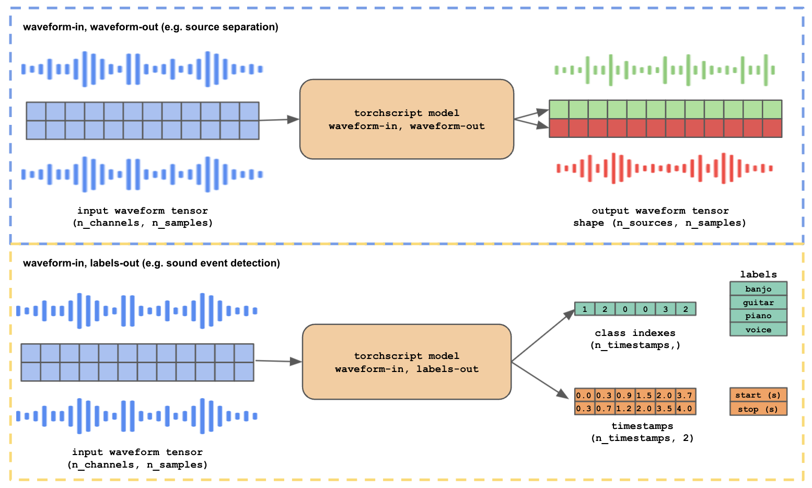

# audacitorch

This package contains utilities for prepping PyTorch audio models for use in Audacity. More specifically, it provides abstract classes for you to wrap your waveform-to-waveform and waveform-to-labels models (see the [Deep Learning for Audacity](https://interactiveaudiolab.github.io/project/audacity) website to learn more about deep learning models for audacity).   

## Table of Contents

- [Downloading Audacity with Deep Learning](#download)
- [Contributing Models to Audacity](#contrib)
- [Choosing an Effect Type ](#effect-types)
    - [Waveform to Waveform models](#wav2wav)
    - [Waveform to Labels models](#wav2labels)
- [Model Metadata](#metadata)
- [Making Your Model Built-In to Audacity](#builtin)
- [Debugging Your Model in Audacity](#debugging)
- [Example - Waveform-to-Waveform](#example-wav2wav)
    - [Making sure your model is compatible with `torchscript`](#compat)
- [Example - Exporting a Pretrained Asteroid Model](#example-asteroid)

--- 


<a name="download"/>

## Download Audacity with Deep Learning

Our work has not yet been merged to the main build of Audacity, though it will be soon. You can keep track of its progress by viewing our [pull request](https://github.com/audacity/audacity/pull/1384). In the meantime, you can download an alpha version of [Audacity + Deep Learning here](https://interactiveaudiolab.github.io/project/audacity.html).

<a name="contrib"/>

## Contributing Models to Audacity

### Supported Torch versions

`audacitorch` requires for your model to be able to run in **Torch 1.9.0**, as that's what the Audacity torchscript interpreter uses. 

### Deep Learning Effect and Analyzer

Audacity is equipped with a wrapper framework for deep learning models written in PyTorch. Audacity contains two deep learning tools: `Deep Learning Effect` and `Deep Learning Analyzer`.  
`Deep Learning Effect` performs waveform to waveform processing, and is useful for audio-in-audio-out tasks (such as source separation, voice conversion, style transfer, amplifier emulation, etc.), while `Deep Learning Analyzer` performs waveform to labels processing, and is useful for annotation tasks (such as sound event detection, musical instrument recognition, automatic speech recognition, etc.).
`audacitorch` contains two abstract classes for serializing two types of models: waveform-to-waveform and waveform-to-labels. The classes are `WaveformToWaveformBase`, and `WaveformToLabelsBase`, respectively. 



<a name="effect-types"/> 

## Choosing an Effect Type 

<a name="wav2wav"/> 

### Waveform to Waveform models

Waveform-to-waveform models receive a single multichannel audio track as input, and may write to a variable number of new audio tracks as output.

Example models for waveform-to-waveform effects include source separation, neural upsampling, guitar amplifier emulation, generative models, etc. Output tensors for waveform-to-waveform models must be multichannel waveform tensors with shape `(num_output_channels, num_samples)`. For every audio waveform in the output tensor, a new audio track is created in the Audacity project. 

<a name="wav2labels"/> 

### Waveform to Labels models

Waveform-to-labels models receive a single multichannel audio track as input, and may write to an output label track as output. The waveform-to-labels effect can be used for many audio analysis applications, such as voice activity detection, sound event detection, musical instrument recognition, automatic speech recognition, etc. The output for waveform-to-labels models must be a tuple of two tensors. The first tensor corresponds to the class probabilities for each label present in the waveform, shape `(num_timesteps, num_classes)`. The second tensor must contain timestamps with start and stop times for each label, shape `(num_timesteps, 2)`.  

### What If My Model Uses a Spectrogram as Input/Output?

If your model uses a spectrogram as input/output, you'll need to wrap your forward pass with some torchscript-compatible preprocessing/postprocessing. We recommend using [torchaudio](https://pytorch.org/audio/stable/index.html), writing your own preprocessing transforms in their own `nn.Module`, or writing your PyTorch-only preprocessing and placing it in `WaveformToWaveform.do_forward_pass` or `WaveformToLabels.do_forward_pass`. See the [compatibility](#compat) section for more info.  

<a name="metadata"/>

## Model Metadata

Certain details about the model, such as its sample rate, tool type (e.g. waveform-to-waveform or waveform-to-labels), list of labels, etc. must be provided by the model contributor in a separate `metadata.json` file. In order to help users choose the correct model for their required task, model contributors are asked to provide a short and long description of the model, the target domain of the model (e.g. speech, music, environmental, etc.), as well as a list of tags or keywords as part of the metadata. 
For waveform-to-label models, the model contributor may include an optional confidence threshold, where predictions with a probability lower than the confidence threshold are labeled as ``uncertain''. 

#### Metadata Spec

required fields:

- `sample_rate` (`int`)
    - range `(0, 396000)`
    - Model sample rate. Input tracks will be resampled to this value. 
- `domains` (`List[str]`)
    - List of data domains for the model. The list should contain any of the following strings (any others will be ignored): `["music", "speech", "environmental", "other"]`
- `short_description`(`str`)
    -  max 60 chars
    -  short description of the model. should contain a brief message with the model's purpose, e.g. "Use me for separating vocals from the background!". 
-  `long_description` (`str`)
    -  max 280 chars
    -  long description of the model. Shown in the detailed view of the model UI.
-  `tags` (`List[str]`)
    -  list of tags (to be shown in the detailed view)
    -  each tag should be 15 characters max
    -  max 5 tags per model. 
-  `labels` (`List[str`)
    -  output labels for the model. Depending on the effect type, this field means different things
    -  **waveform-to-waveform**
        -  name of each output source (e.g. `drums`, `bass`, `vocal`). To create the track name for each output source, each one of the labels will be appended to the mixture track's name.
    -  **waveform-to-labels**:
        -  labeler models should output a list of class probabilities with shape `(n_timesteps, n_class)` and a list of start/stop timestamps for each label `(n_timesteps, 2)`. The labeler effect will create a add new labels by taking the argmax of each class probability and indexing into the metadata's `labels`. 
-  `effect_type` (`str`)
    -  Target effect for this model. Must be one of `["waveform-to-waveform", "waveform-to-labels"]`. 
-  `multichannel` (`bool`)
    -  If `multichannel` is set to `true`, stereo tracks are passed to the model as multichannel audio tensors, with shape `(2, n)`. Note that this means that the input could either be a mono track with shape `(1, n)` or stereo track with shape `(2, n)`.
    -  If `multichannel` is set to `false`, stereo tracks are downmixed, meaning that the input audio tensor will always be shape `(1, n)`.

---

<a name="builtin"/>

## Making Your Model Built-In To Audacity

By default, users have to click on the `Add From HuggingFace` button on the Audacity Model Manager and enter the desired repo's ID to install a community contributed model. If you, instead, would like your community contributed model to show up in Audacity's Model Manager by default, please open a request [here](https://github.com/hugofloresgarcia/audacitorch/issues/new?assignees=hugofloresgarcia&labels=model-contrib&template=built-in-model-request.md&title=Built-in+Model+Request%3A+MODEL_NAME). 

<a name="example-wav2wav"/>

## Example - Waveform-to-Waveform model

Here's a minimal example for a model that simply boosts volume by multiplying the incoming audio by a factor of 2. 

We can sum up the whole process into 4 steps:

1. [Developing your model](#developing)
2. [Wrapping your model using `audacitorch`](#wrapping)
3. [Creating a metadata document](#creating-metadata) 
4. [Exporting to HuggingFace](#exporting)

<a name="developing"/>

### Developing your model

First, we create our model. There are no internal constraints on what the internal model architecture should be, as long as you can use `torch.jit.script` or `torch.jit.trace` to serialize it, and it is able to meet the input-output constraints specified in waveform-to-waveform and waveform-to-labels models. 

```python
import torch
import torch.nn as nn

class MyVolumeModel(nn.Module):

    def forward(self, x: torch.Tensor) -> torch.Tensor:
        # do the neural net magic!
        x = x * 2

        return x
```

<a name="compat"/>

#### Making sure your model is compatible with `torchscript`
PyTorch makes it really easy to deploy your Python models in C++ by using `torchscript`, an intermediate representation format for torch models that can be called in C++. Many of Python's built-in functions are supported by torchscript. However, not all Python operations are supported by the torchscript environment, meaning that you are only allowed to use a subset of Python operations in your model code. See [the torch.jit docs](https://pytorch.org/docs/master/jit.html#python-functions-and-modules) to learn more about writing torchscript-compatible code. 

If your model computes spectrograms (or requires any kind of preprocessing/postprocessing), make sure those operations are compatible with torchscript, like [torchaudio](https://pytorch.org/tutorials/beginner/audio_preprocessing_tutorial.html#feature-extractions)'s operation set. 

Useful links:
- [Torchscript reference](https://pytorch.org/docs/master/jit.html)
- [Pytorch's tutorial on torchscript models](https://pytorch.org/tutorials/advanced/cpp_export.html#step-1-converting-your-pytorch-model-to-torch-script)
- [A 1:1 mapping of the features in python to their support in torchscript](https://pytorch.org/docs/master/jit_python_reference.html#python-language-reference)
- (**recommended**) [Mastering Torchscript: Tracing vs Scripting, Device Pinning, Direct Graph Modification](https://paulbridger.com/posts/mastering-torchscript/)

<a name="wrapping"/>

### Wrapping your model using `audacitorch`

Now, we create a wrapper class for our model. Because our model returns an audio waveform as output, we'll use `WaveformToWaveformBase` as our parent class. For both `WaveformToWaveformBase` and `WaveformToLabelsBase`, we need to implement the `do_forward_pass` method with our processing code. See the [docstrings](/audacitorch/core.py) for more details. 

```python
from audacitorch import WaveformToWaveformBase

class MyVolumeModelWrapper(WaveformToWaveformBase):
    
    def do_forward_pass(self, x: torch.Tensor) -> torch.Tensor:
        
        # do any preprocessing here! 
        # expect x to be a waveform tensor with shape (n_channels, n_samples)

        output = self.model(x)

        # do any postprocessing here!
        # the return value should be a multichannel waveform tensor with shape (n_channels, n_samples)
    
        return output
```

<a name="creating-metadata"/>

### Creating a metadata document

Audacity models need a metadata file. See the metadata [spec](#metadata-spec) to learn about the required fields. 

```python
metadata = {
    'sample_rate': 48000, 
    'domain_tags': ['music', 'speech', 'environmental'],
    'short_description': 'Use me to boost volume by 3dB :).',
    'long_description':  'This description can be a max of 280 characters aaaaaaaaaaaaaaaaaaaa.',
    'tags': ['volume boost'],
    'labels': ['boosted'],
    'effect_type': 'waveform-to-waveform',
    'multichannel': False,
}

```

All set! We can now proceed to serialize the model to torchscript and save the model, along with its metadata.

```python
from pathlib import Path
from audacitorch.utils import save_model, validate_metadata, \
                              get_example_inputs, test_run

# create a root dir for our model
root = Path('booster-net')
root.mkdir(exist_ok=True, parents=True)

# get our model
model = MyVolumeModel()

# wrap it
wrapper = MyVolumeModelWrapper(model)

# serialize it using torch.jit.script, torch.jit.trace,
# or a combination of both. 

# option 1: torch.jit.script 
# using torch.jit.script is preferred for most cases, 
# but may require changing a lot of source code
serialized_model = torch.jit.script(wrapper)

# option 2: torch.jit.trace
# using torch.jit.trace is typically easier, but you
# need to be extra careful that your serialized model behaves 
# properly after tracing
example_inputs = get_example_inputs()
serialized_model = torch.jit.trace(wrapper, example_inputs[0], 
                                    check_inputs=example_inputs)

# take your model for a test run!
test_run(serialized_model)

# check that we created our metadata correctly
success, msg = validate_metadata(metadata)
assert success

# save!
save_model(serialized_model, metadata, root)
```

<a name="exporting"/>

### Exporting to HuggingFace

You should now have a directory structure that looks like this: 

```
/booster-net/
/booster-net/model.pt
/booster-net/metadata.json
```

This will be the repository for your audacity model. Make sure to add a readme with the `audacity` tag in the YAML metadata, so it show up on the explore tab of Audacity's Deep Learning Tools. 

Create a `README.md` inside `booster-net/`, and add the following header:


in README.md
```
---
tags: audacity
---
```

Awesome! It's time to push to HuggingFace. See their [documentation](https://huggingface.co/docs/hub/adding-a-model) for adding a model to the HuggingFace model hub. 

<a name="debugging"/>

## Debugging Your Model in Audacity

After serializing, you may need to debug your model inside Audacity, to make sure that it handles inputs correctly, doesn't crash while processing, and produces the correct output. 
While debugging, make sure your model isn't available through other users through the `Explore HuggingFace` button by temporarily removing the `audacity` tag from your README file.
If your model fails internally while processing audio, you may see something like this:


To debug, you can access the error logs through the Help menu, in `Help->Diagnostics->Show Log...`. Any torchscript errors that may occur during the forward pass will be redirected here. 


<a name="example-asteroid"/>

## Example - Exporting a Pretrained [Asteroid](https://github.com/asteroid-team/asteroid) model

See this [example notebook](/notebooks/example.ipynb), where we serialize a pretrained ConvTasNet model for speech separation using the [Asteroid](https://github.com/asteroid-team/asteroid) source separation library.

---
